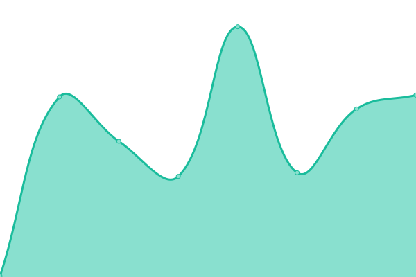

# [📈 Live Status](https://status.esport.cologne): <!--live status--> **🟩 All systems operational**

This repository contains the open-source uptime monitor and status page for [eSports Cologne](https://esport.cologne), powered by [Upptime](https://github.com/upptime/upptime).

With [Upptime](https://upptime.js.org), you can get your own unlimited and free uptime monitor and status page, powered entirely by a GitHub repository. We use [Issues](https://github.com/eSports-Cologne-Dev/upptime/issues) as incident reports, [Actions](https://github.com/eSports-Cologne-Dev/upptime/actions) as uptime monitors, and [Pages](https://status.esport.cologne) for the status page.

<!--start: status pages-->
<!-- This summary is generated by Upptime (https://github.com/upptime/upptime) -->
<!-- Do not edit this manually, your changes will be overwritten -->
<!-- prettier-ignore -->
| URL | Status | History | Response Time | Uptime |
| --- | ------ | ------- | ------------- | ------ |
|  [eSports Cologne](https://esport.cologne) | 🟩 Up | [e-sports-cologne.yml](https://github.com/eSports-Cologne-Dev/upptime/commits/HEAD/history/e-sports-cologne.yml) | 

 1872ms
     
 | 

<a href="https://status.esport.cologne/history/e-sports-cologne">100.00%</a>
    

|  ECO Drive | 🟩 Up | [eco-drive.yml](https://github.com/eSports-Cologne-Dev/upptime/commits/HEAD/history/eco-drive.yml) | 

 1042ms
     
 | 

<a href="https://status.esport.cologne/history/eco-drive">100.00%</a>
    

|  ECO Intern | 🟩 Up | [eco-intern.yml](https://github.com/eSports-Cologne-Dev/upptime/commits/HEAD/history/eco-intern.yml) | 

 885ms
     
 | 

<a href="https://status.esport.cologne/history/eco-intern">100.00%</a>
    

<!--end: status pages-->

[**Visit our status website →**](https://status.esport.cologne)

## 📄 License

- Powered by: [Upptime](https://github.com/upptime/upptime)
- Code: [MIT](./LICENSE) © [eSports Cologne](https://esport.cologne)
- Data in the `./history` directory: [Open Database License](https://opendatacommons.org/licenses/odbl/1-0/)
